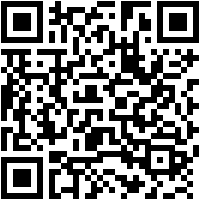

  

<h1 align="center" style="font-size: 36px;">Encodeify 📲</h1>

Bridging the Digital & Physical Worlds, One QR Code at a Time! 🌐🔗 
Welcome to Encodeify—your ultimate tool for generating and scanning QR codes. Whether you’re using our web app or mobile app, Encodeify makes it easy to encode and decode information with ease. Let’s make connectivity seamless!

  

<h3 align="center">Download the App Instantly! 📲</h3>

  

Scan this QR code to download the Encodeify app directly to your device!

## 📋 Table of Contents

- [🌟 What is Encodeify?](#what-is-encodeify)
- [🚀 Features That Shine](#features-that-shine)
- [🔧 Web Version](#web-version)
- [📱 Mobile Version](#mobile-version)
- [🛠️ Getting Started](#getting-started)
- [🤝 Contribute & Collaborate](#contribute--collaborate)
- [📜 License Info](#license-info)
- [📧 Contact Us](#contact-us)

# 🌟 What is Encodeify?

Welcome to **Encodeify**! 🎉 Your comprehensive solution for generating and scanning QR codes. Whether you're on the web or on the go with your mobile device, Encodeify makes sharing and accessing information simpler and faster. From creating QR codes for websites to scanning them on the fly, Encodeify is here to streamline your digital interactions. 🌐✨

# 🚀 Features That Shine

- **Instant QR Code Generation**: Easily create QR codes for URLs, contact info, Wi-Fi networks, and more. ⚡
- **User-Friendly Interface**: Both our web and mobile apps offer a smooth and intuitive experience. 🎯
- **Versatile Encoding & Scanning**: Encode a variety of information and scan QR codes with advanced options. 📊
- **Copy & Download Options**: On the web, you can copy or download QR codes. 📥
- **Mobile Scanning Features**:
  - **Scan QR Codes**: Use your camera to scan QR codes quickly. 📷
  - **Flashlight Toggle**: Turn the flashlight on or off for better scanning in low light. 🔦
  - **Camera Switching**: Switch between the front and back cameras effortlessly. 🔄

# 🔧 Web Version

The web version of Encodeify is perfect for quick and easy QR code creation:

1. **Visit Encodeify Web App**: Go to [Encodeify Demo](https://encodeify.netlify.app/) to start using the web application.
2. **Input Data**: Enter the URL or text you want to encode.
3. **Generate & Save**: Click "Generate" to create your QR code, then copy or download it as needed.

# 📱 Mobile Version

Our mobile app offers a powerful QR code scanning experience with additional features:

1. **Download the App**: Get the mobile version from your app store (link to be added).
2. **Generate QR Codes**: Create QR codes directly from your phone for any type of content.
3. **Scan QR Codes**: Use the app's built-in camera to scan QR codes.
   - **Flashlight Toggle**: Tap the flashlight icon to switch it on or off.
   - **Camera Switch**: Easily switch between front and back cameras.
4. **Save and Share**: Save scanned codes or share them directly from the app.

# 🛠️ Getting Started

1. **For Web Users**: Visit [Encodeify Demo](https://encodeify.netlify.app/) to start creating QR codes.
2. **For Mobile Users**: Download the mobile app, generate QR codes, and use the scan feature with added functionality.

# 🤝 Contribute & Collaborate

We welcome contributions from the community! If you’d like to help improve Encodeify:

1. Fork the Encodeify repository on GitHub.
2. Create a new branch for your feature or bug fix.
3. Implement your changes and ensure all tests pass.
4. Submit a pull request with a clear description of your updates.

# 📜 License Info

Encodeify is licensed under the MIT License, promoting open collaboration and sharing. Check out the [LICENSE](LICENSE) file for more details. 📄

# 📧 Contact Us

Have questions or feedback? Reach out to us at [konainraza105@gmail.com](mailto:konainraza105@gmail.com). We’d love to hear from you! ✉️
